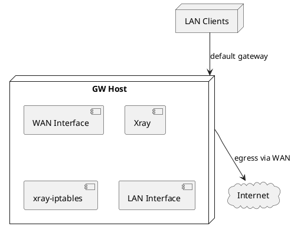
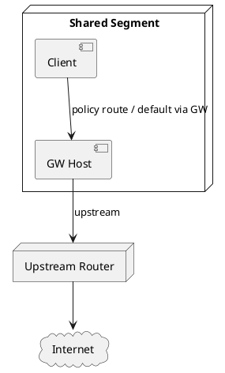
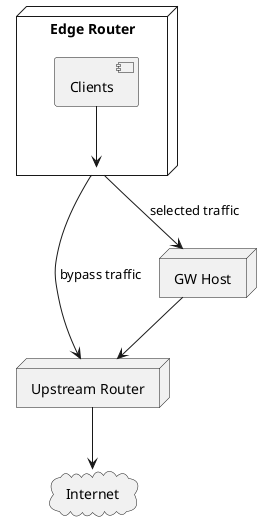
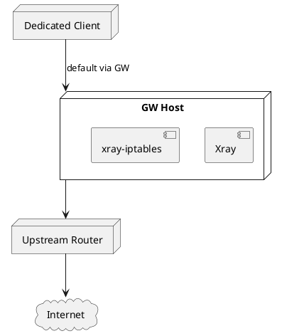

[](https://github.com/Torotin/xray-gateway-installer/commits)
[](https://www.debian.org/)
[](https://github.com/XTLS/Xray-core)

# Xray Gateway Installer

`Xray Gateway Installer` — модульный bash-проект для развёртывания gateway-хоста на базе `Xray-core` с transparent routing через `iptables-legacy`, `REDIRECT` и опциональный `TPROXY`.

Проект ориентирован на эксплуатацию Debian gateway-хоста:
- с install-time подготовкой системы;
- с runtime-приведением firewall и routing к целевому состоянию;
- с консервативной работой по отношению к существующим Xray JSON-конфигам.

## Назначение

Проект подходит для двух основных сценариев:
- `inline-lan` — классический gateway между `WAN` и `LAN`;
- `policy-gateway` — single-segment или upstream policy routing через GW для выбранных источников.

## Поддерживаемая среда

- `Debian 12+`
- `systemd`
- `iptables-legacy`
- `iproute2`

Не входят в официальный baseline:
- `Ubuntu`
- `nftables-only`
- полноценный `IPv6 transparent proxy`

## Ключевые возможности

- установка `Xray-core` в `/opt/xray` с запуском от `xray:xray`;
- модульная архитектура: `installer.sh`, `core/*`, `modules/*`, `plugins/*`, `templates/*`;
- генерация systemd drop-in для `xray.service`;
- runtime firewall в `/opt/xray/iptables/xray-iptables.sh`;
- поддержка `tcp-only` и `tcp-udp` режимов transparent routing;
- идемпотентное применение `ip rule`, `ip route`, `iptables`;
- kill-switch цепочка `XRAY_DISABLED`;
- автоопределение effective transparent-портов из merged Xray-конфига;
- отключение `send_redirects/accept_redirects` на задействованных интерфейсах;
- обновление geo-данных и monitoring через systemd/скрипты;
- monitoring использует `systemd timer` как canonical scheduler; legacy cron-записи мониторинга при install/uninstall очищаются;
- сохранение существующих `/opt/xray/configs/*.json` без перезаписи при install/reinstall.

## Базовый Xray baseline

Базовые JSON-конфиги вынесены в `templates/xray-base/*.template.json`.

Стартовый набор включает:
- `00_api.json`
- `01_log.json`
- `02_dns.json`
- `03_inbounds.json`
- `04_outbounds.json`
- `05_routing.json`
- `06_observatory.json`
- `07_policy.json`

Базовые свойства:
- `redirect` обслуживает `TCP`;
- `tproxy` обслуживает `UDP`;
- DNS baseline использует string-form DNS servers, поддерживаемые Xray;
- стартовый `02_dns.json` использует несколько `https+local://...` upstream'ов;
- секция `hosts` в `02_dns.json` содержит заранее зафиксированные IPv4-адреса для hostname upstream'ов.
- `00_api.json` и `06_observatory.json` в базовом наборе создаются как нейтральные placeholder-файлы;
- policy baseline использует `handshake=4` и `connIdle=300`;
- для web-heavy gateway baseline `uplinkOnly` и `downlinkOnly` установлены в `0`;
- `bufferSize` в policy явно не задаётся, чтобы Xray использовал платформенный default.

Legacy-шаблон [templates/xray.template.json](/mnt/x/xray-gateway-installer/templates/xray.template.json) синхронизирован с тем же DNS baseline.

## Поведение с существующими конфигами

Если в `/opt/xray/configs` уже есть пользовательские `*.json`, install-flow:
- не затирает их;
- создаёт snapshot в `/opt/xray/config-backups/preserved-*`;
- продолжает работу с существующим набором конфигов.

Это правило распространяется и на `02_dns.json`.

## Быстрый старт

```bash
git clone https://github.com/Torotin/xray-gateway-installer.git
cd xray-gateway-installer
chmod +x ./installer.sh
sudo ./installer.sh install
```

Короткие service-oriented вызовы:

```bash
./installer.sh firewall
./installer.sh monitoring
```

Они интерпретируются как `status`.

Отдельный refresh core/runtime:

```bash
./installer.sh update
```

`update` выполняет принудительное обновление Xray Core, пересоздаёт update-скрипты, повторно применяет Geo baseline, systemd override и запускает `xray.service` уже с текущим `/opt/xray/configs`.

## Что делает install-flow

В штатном install-flow установщик:
- проверяет и при необходимости доустанавливает обязательные зависимости;
- подготавливает системные настройки;
- устанавливает Xray;
- сохраняет существующие конфиги при их наличии;
- генерирует runtime firewall и systemd units;
- настраивает monitoring и update scripts.

Обязательные зависимости install baseline:
- `jq`
- `cron` / `crontab`
- `curl`
- `wget`
- `yq`
- `git`
- `unzip`
- `iptables`
- `iproute2`

После установки дополнительно проверяется, что `cron.service` существует и активен.

Проверка зависимостей выполняется из `core/04_dependencies.sh`. Для корректной работы install-flow таблицы обязательных и опциональных зависимостей объявлены как глобальные ассоциативные массивы, чтобы проверка не теряла `cron/crontab`, `jq`, `yq` и другие пакеты после `init` внутри `installer.sh`.

Полная dependency precheck автоматически выполняется только для `install` и `update`. Команды `status`, `firewall`, `monitoring` и `uninstall` не должны побочно включать сервисы или доустанавливать пакеты, если оператор просто смотрит состояние или снимает runtime.

Для monitoring cron не используется как основной планировщик:
- `xray-monitoring-collector.timer` является canonical baseline;
- legacy cron-записи `monitoring.sh collect` очищаются автоматически, чтобы install/reinstall не плодили дубликаты.

Для update-задач Xray canonical baseline пока остаётся на `cron`:
- `/opt/xray/updates/update-xray-core.sh`
- `/opt/xray/updates/update-geo-data.sh`
- repeated `install/reinstall` должен сохранять ровно по одной cron-строке на каждую update-задачу;
- `uninstall` должен полностью удалять обе update-строки, не затрагивая посторонние записи в `crontab`.

Install-flow использует внешний `XTLS/Xray-install`, но его stdout/stderr встраивается в rollout ограниченно: на успешном пути installer пишет в журнал проекта только наши operator-friendly сообщения, а подробный хвост внешнего installer показывается только при ошибках.

## Что делает uninstall

Команда:

```bash
sudo ./installer.sh uninstall
```

Удаление выполняется в порядке, безопасном для runtime teardown:
- сначала снимаются плагины;
- затем удаляются Xray-модули;
- в конце восстанавливаются системные настройки.

В текущем baseline `uninstall`:
- останавливает и удаляет `xray`, `xray-iptables`, monitoring и kill-switch units;
- снимает `ip rule`, `ip route` и `iptables`-цепочки `XRAY*`, включая policy-scope цепочки `XRAY_PREROUTING` и `XRAY_NAT_PREROUTING`;
- удаляет `/opt/xray` и systemd override для `xray.service`;
- удаляет compatibility-alias в `/usr/local/bin`:
  - `geoip.dat`
  - `geosite.dat`
  - `geoip_zkeenip.dat`
- очищает cron-задачи обновлений Xray;
- восстанавливает root/SSH и системные параметры из backup-пути модуля `system`.

`uninstall` рассчитан на повторный запуск и должен безопасно дочищать частично удалённое состояние.

## Ожидаемые runtime-пути

- `/opt/xray/configs`
- `/opt/xray/logs`
- `/opt/xray/dat`
- `/opt/xray/iptables`
- `/opt/xray/updates`
- `/opt/xray/monitoring`
- `/opt/xray/config-backups`

## Базовая валидация

После установки:

```bash
systemctl status xray xray-iptables xray-monitoring-collector.timer
/usr/local/bin/xray run -test -confdir /opt/xray/configs
/opt/xray/iptables/xray-iptables.sh status
ip rule show
ip route show table 233
iptables -t mangle -S XRAY
iptables -t nat -S XRAY
```

Проверка внешнего доступа с GW:

```bash
curl -4 https://2ip.io
```

Проверка client-through-gateway сценария:

```bash
curl -4 -I https://example.com
curl -4 -I https://github.com
curl -4 https://2ip.io
```

## Управление runtime firewall

Файлы управления:
- `/opt/xray/iptables/xray-iptables.mode`
- `/opt/xray/iptables/xray-policy-iptables.interfaces`
- `/opt/xray/iptables/xray-policy-iptables.cidrs`
- `/opt/xray/iptables/xray-policy-iptables.ips`
- `/opt/xray/iptables/xray-exclude-iptables.cidrs`
- `/opt/xray/iptables/xray-exclude-iptables.ips`
- `/opt/xray/iptables/xray-exclude-iptables.ports`

Применение изменений:

```bash
sudo /opt/xray/iptables/xray-iptables.sh restart
```

При `systemctl restart xray` runtime firewall переапплицируется автоматически через `ExecStartPost`. На живом GW после рестарта возможна короткая переходная пауза, пока Xray заново поднимет inbounds и firewall завершит `restart`.

Безопасный runtime baseline:

```bash
echo tcp-only | sudo tee /opt/xray/iptables/xray-iptables.mode
sudo /opt/xray/iptables/xray-iptables.sh restart
```

Пример single-segment `policy-gateway`:

```bash
echo eth0 | sudo tee /opt/xray/iptables/xray-policy-iptables.interfaces
echo 192.168.255.146 | sudo tee /opt/xray/iptables/xray-policy-iptables.ips
: | sudo tee /opt/xray/iptables/xray-policy-iptables.cidrs
echo tcp-only | sudo tee /opt/xray/iptables/xray-iptables.mode
sudo /opt/xray/iptables/xray-iptables.sh restart
```

## Режимы использования

### Inline LAN Gateway



### Single-Segment Policy Gateway



### Router Upstream To GW



### Dedicated Client Through GW



## Структура репозитория

```text
xray-gateway-installer/
├── installer.sh
├── core/
├── modules/
│   ├── system/
│   └── xray/
├── plugins/
│   ├── firewall/
│   ├── monitoring/
│   └── updates_backup/
├── templates/
│   ├── xray-base/
│   ├── iptables.template.sh
│   ├── sysctl.conf.template
│   ├── update-geo-data.template.sh
│   ├── update-xray-core.template.sh
│   └── xray.template.json
├── config/
└── _project_context/
```

## GeoIP / GeoSite

Установщик создаёт:
- `/opt/xray/updates/update-geo-data.sh`
- `/opt/xray/updates/update-xray-core.sh`

Обновление geo-данных:

```bash
sudo /opt/xray/updates/update-geo-data.sh
```

Обновление Xray:

```bash
sudo /opt/xray/updates/update-xray-core.sh
```

## Частые проверки

Проверить DNS и proxy-path через клиента:

```bash
curl -4 -I https://example.com
curl -4 -I https://github.com
curl -4 https://2ip.io
```

Проверить логи Xray:

```bash
tail -n 100 /opt/xray/logs/error.log
tail -n 100 /opt/xray/logs/access.log
```

Проверить merged runtime shape:

```bash
/usr/local/bin/xray run -dump -confdir /opt/xray/configs
```

Проверить статус firewall:

```bash
/opt/xray/iptables/xray-iptables.sh status
```

## Ограничения

- проект зависит от внешнего `XTLS/Xray-install`;
- `install` остаётся side-effectful и изменяет system-level state;
- `policy-gateway` сейчас задаётся runtime-файлами, а не отдельным верхнеуровневым profile-командным режимом;
- часть live-сценариев подтверждена на `Debian 13`, а не только на `Debian 12`.

## Лицензия

Проект распространяется по [LICENSE.md](LICENSE.md).

## Поддержка

- Issues: [GitHub Issues](https://github.com/Torotin/xray-gateway-installer/issues)
- инженерный контекст проекта: [_project_context/README.md](/mnt/x/xray-gateway-installer/_project_context/README.md)
